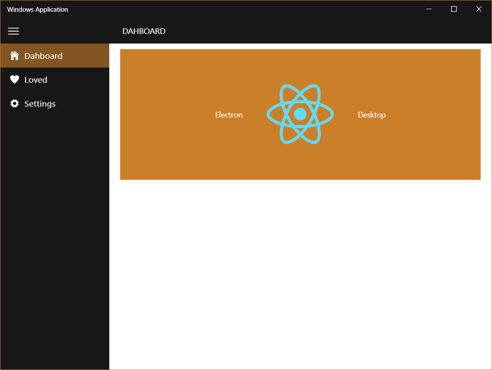
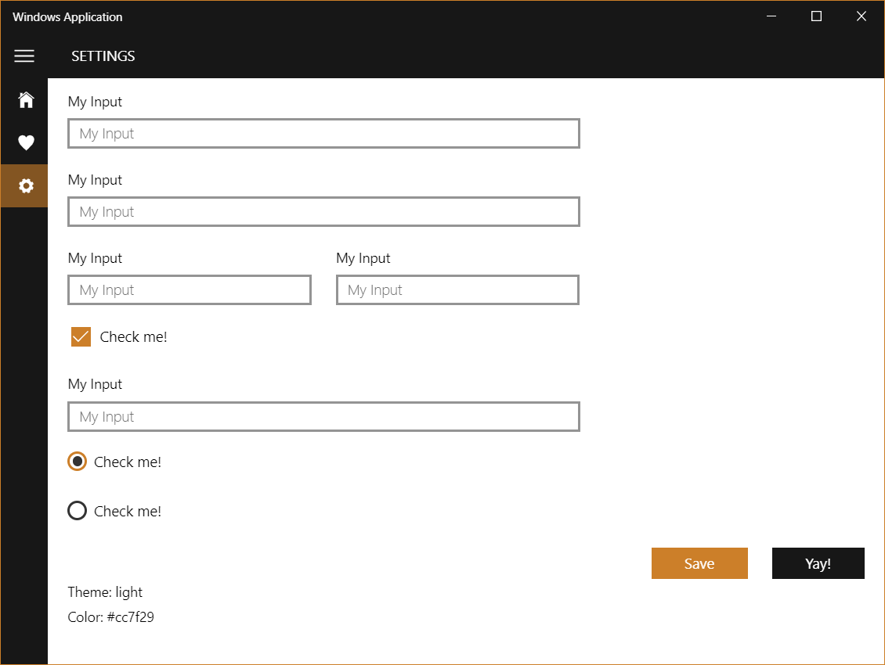

>### Windows 10 UI version of [electron-create-react-app](https://github.com/davchezt/electron-create-react-app) repo

This project was bootstrapped with [Create React App](https://github.com/facebook/create-react-app).

## What Inside?
* Deep linking
* Windows notification using [node-notifier](https://github.com/davchezt/node-notifier)
* Tray menu
* Windows 10 [UI](http://reactdesktop.js.org/)





## Install
```
git clone https://github.com/davchezt/electron-create-react-app-winui.git MyApp

cd MyApp

yarn install
```

## Available Scripts

In the project directory, you can run:

### `yarn start`

Runs the app in the development mode.

The page will reload if you make edits.<br>
You will also see any lint errors in the console.

### `yarn test`

Launches the test runner in the interactive watch mode.<br>
See the section about [running tests](https://facebook.github.io/create-react-app/docs/running-tests) for more information.

### `yarn run build`

Builds and package the app for production.

### `yarn run eject`

**Note: this is a one-way operation. Once you `eject`, you can’t go back!**

If you aren’t satisfied with the build tool and configuration choices, you can `eject` at any time. This command will remove the single build dependency from your project.

Instead, it will copy all the configuration files and the transitive dependencies (Webpack, Babel, ESLint, etc) right into your project so you have full control over them. All of the commands except `eject` will still work, but they will point to the copied scripts so you can tweak them. At this point you’re on your own.

You don’t have to ever use `eject`. The curated feature set is suitable for small and middle deployments, and you shouldn’t feel obligated to use this feature. However we understand that this tool wouldn’t be useful if you couldn’t customize it when you are ready for it.